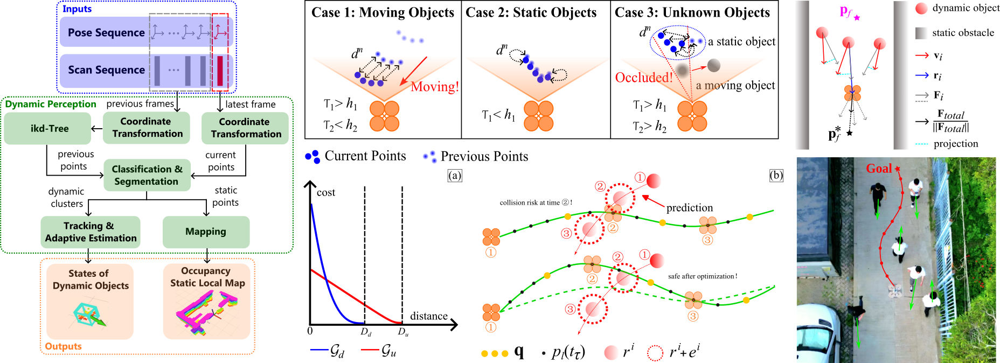

<!--
 Author Information
 * @Author: bowen-xu link.bowenxu@connect.hku.hk
 * @Date: 2025-06-25 20:09:36
 * @LastEditors: bowen-xu link.bowenxu@connect.hku.hk
 * @LastEditTime: 2025-09-06 19:15:56
 * @Description: 
 * 
 * Copyright (c) 2025 by bowen-xu link.bowenxu@connect.hku.hk, All Rights Reserved. 
-->
<div align = "center">
  <h1>
    FAPP 
  </h1>
</div>
<div align = "center">
  <h2>
    Fast and Adaptive Perception and Planning for UAVs in Dynamic Cluttered Environments
  </h2>
</div>
<div align="center">
  <strong>
        Minghao Lu,
        Xiyu Fan,
        Han Chen, and
        Peng Lu<sup>†</sup>
  </strong>
  <p>
    <sup>†</sup>Corresponding Author
  </p>
  <a href="https://ieeexplore.ieee.org/document/10816005"></a>
  <a href='https://arxiv.org/pdf/2312.08743.pdf'></a>
  <a href='https://www.bilibili.com/video/BV1tpkMYEELF/?spm_id_from=333.1387.upload.video_card.click&vd_source=038c861e9419962098b9dc6162ccee43'></a>
  <a href='https://www.youtube.com/watch?v=-0l-_cR8NkQ'></a>
  <a href="https://mp.weixin.qq.com/s/nrjIWLI3TfUIXH2wxCVqOw"></a>
</div>

## 💡 News 
* **[2025.06.25]** The source code of **FAPP** is released !
* **[2024.12.16]** **FAPP** is accepted by TRO 2024 🚀 !

## 📜 Introduction

**FAPP** (**F**ast and **A**daptive **P**erception and **P**lanning) is one of the first few works that consider the obstacle avoidance of UAVs in highly cluttered and dynamic environments. The performance of FAPP is validated in various simulation and experimental tests. The whole perception and planning process can be completed within a few milliseconds, which is highly efficient. (Click the image to view the video)

[](https://www.bilibili.com/video/BV1tpkMYEELF/?spm_id_from=333.1387.upload.video_card.click&vd_source=038c861e9419962098b9dc6162ccee43)

Please cite our paper if you use this project in your research:

```
@ARTICLE{10816005,
  author={Lu, Minghao and Fan, Xiyu and Chen, Han and Lu, Peng},
  journal={IEEE Transactions on Robotics}, 
  title={FAPP: Fast and Adaptive Perception and Planning for UAVs in Dynamic Cluttered Environments}, 
  year={2025},
  volume={41},
  number={},
  pages={871-886},
  keywords={Dynamics;Vehicle dynamics;Collision avoidance;Heuristic algorithms;Planning;Autonomous aerial vehicles;Real-time systems;Navigation;Motion segmentation;Robot kinematics;Aerial systems;dynamic environment;motion planning;obstacle avoidance;point cloud},
  doi={10.1109/TRO.2024.3522187}}

```
Please kindly star ⭐️ this project if it helps you. We take great efforts to develop and maintain it 😁.

## 🛠️ Installation

### Test Environment
* Ubuntu 20.04
* ROS Noetic

### 🚀 Quick Start

#### Clone our repository and build
```bash
git clone https://github.com/arclab-hku/FAPP.git
cd FAPP 
catkin build
```
#### Configure tmux
*This procedure is optional*: You can choose to launch all the ros nodes in `quick_start.yaml` one by one.

```bash
# install tmux
sudo apt install tmux
sudo apt install tmuxp
# kill a session (for example)
tmux kill-session -t fapp
```

#### Launch the system
```bash
tmuxp load quick_start.yaml 
```

Trigger the quadrotor by the `3D Nav Goal` in Rviz.

https://github.com/user-attachments/assets/87fddb00-c4af-4772-a650-ba3cdaa09d5c

### 🛰️ Test in other available scenarios
Stay tuned for the upcoming update.


## 🤓 Acknowledgments

We would like to express our gratitude to the following projects, which have provided significant support and inspiration for our work:
- [GCOPTER](https://github.com/ZJU-FAST-Lab/GCOPTER): A general-purpose trajectory optimizer for multicopters.
- [EGO-Planner](https://github.com/ZJU-FAST-Lab/EGO-Planner-v2): An efficient framework for gradient-based quadrotor local planning.

